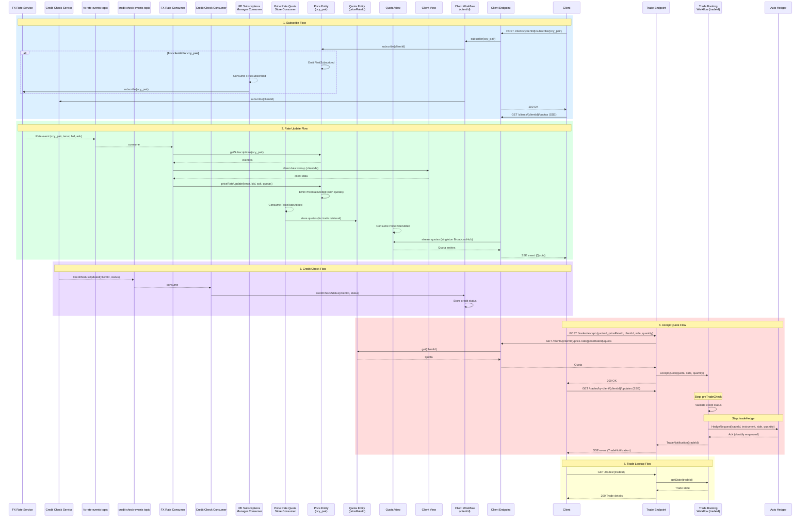
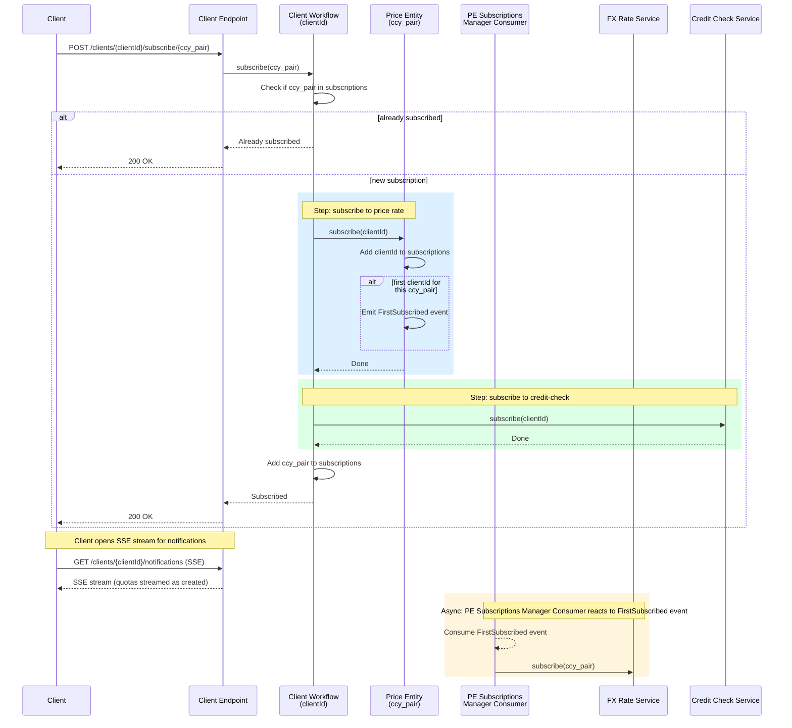
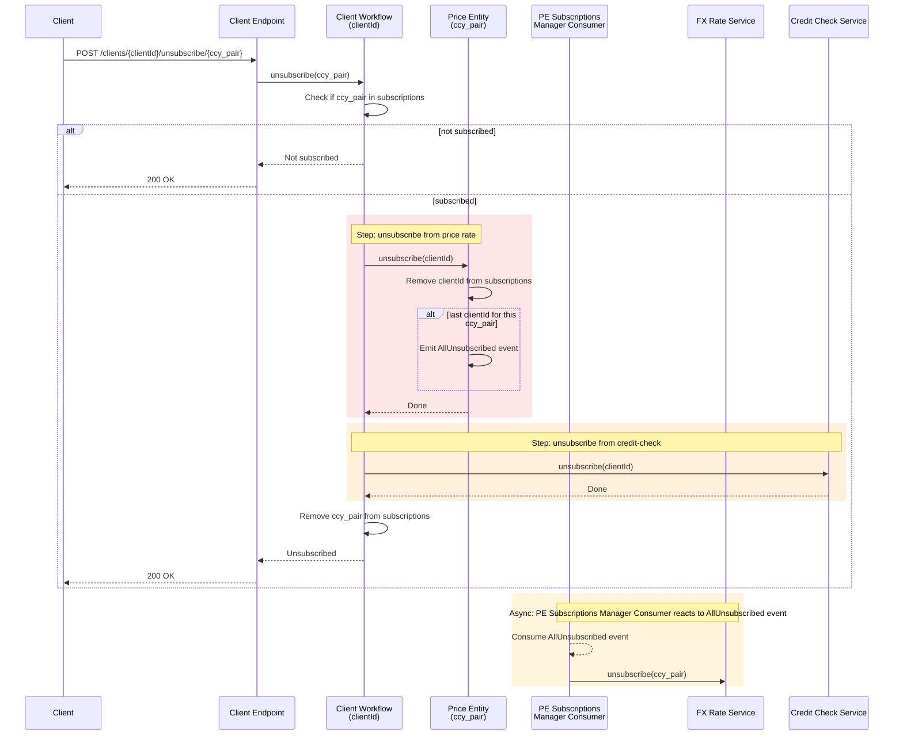
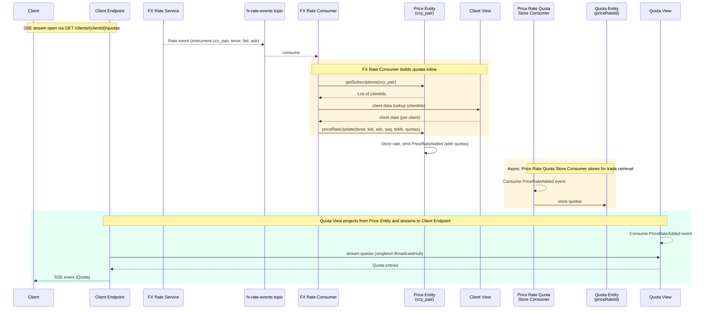
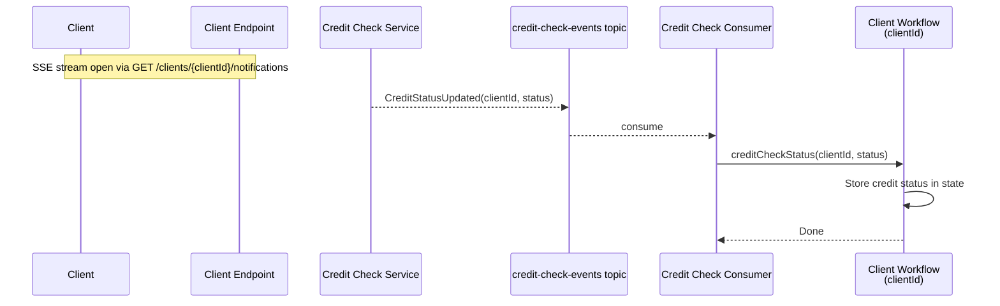
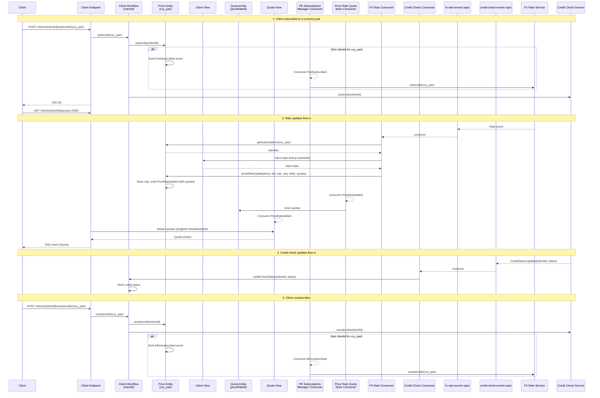
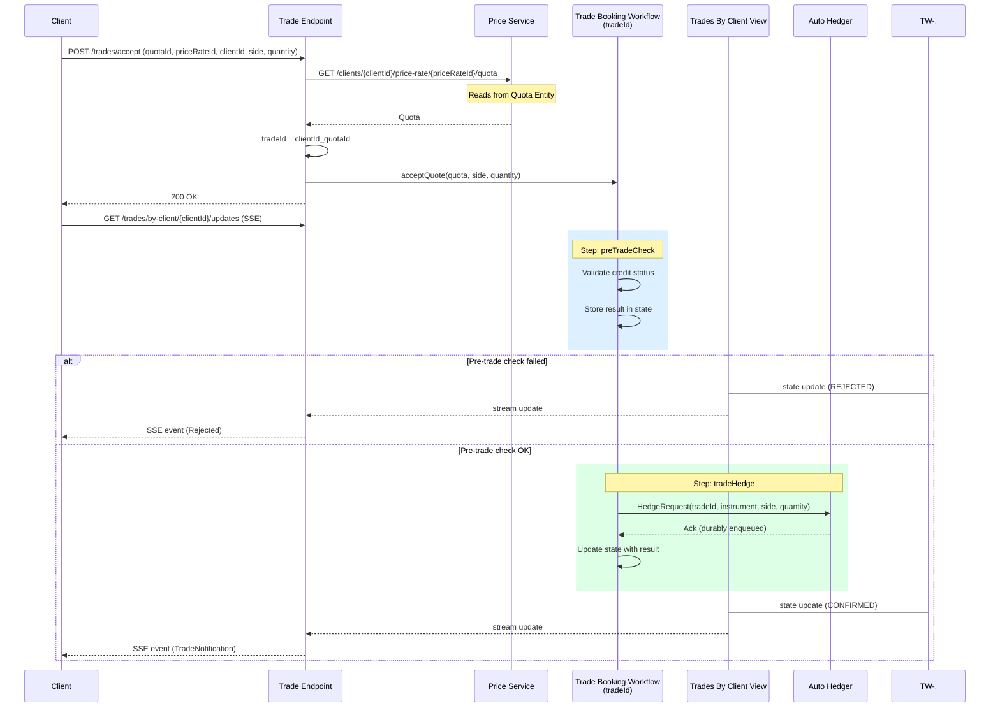
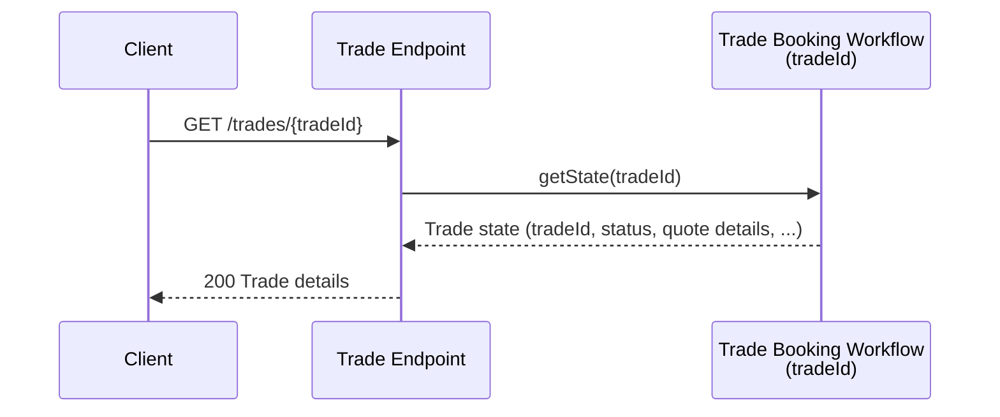
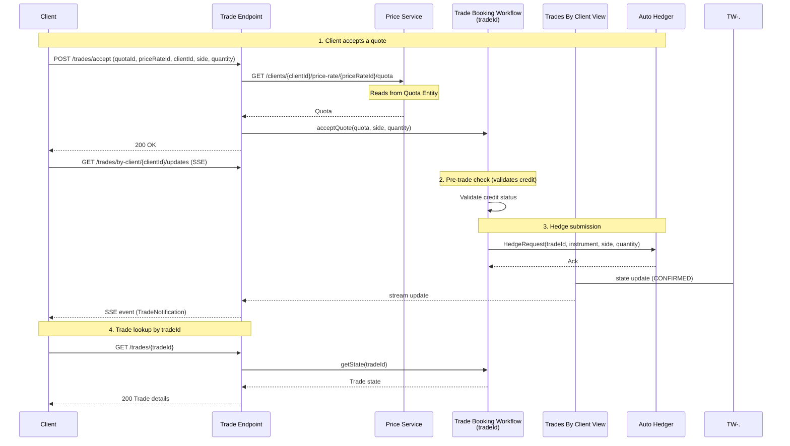

# FX Trading Platform

## Build & Run Locally

Compile all modules:

```shell
mvn compile
```

Run all tests (unit + integration):

```shell
mvn verify
```

### Running the services

Each service runs as a separate process. Open two terminals:

**Terminal 1 - Pricing Service (port 9001):**

```shell
mvn compile exec:java -pl price-service
```

**Terminal 2 - Trade Booking Service (port 9002):**

```shell
mvn compile exec:java -pl trade-booking-service
```

## Akka CLI

Install the Akka CLI:

```shell
brew install akka/akka/akka
```

Or follow the [official installation instructions](https://doc.akka.io/reference/cli/index.html) for your platform.

### Local console

While the services are running locally, open the Akka local console to inspect component state, events, and views:

```shell
akka local console
```

This opens a browser-based UI at `http://localhost:9999` where you can browse entities, workflows, views, and topics in real time.

## Web UI

The pricing service includes a built-in web UI served at `http://localhost:9001/`. It provides a single-page dashboard for interacting with the platform:

- **Client ID** — configurable at the top; changing it reloads the client's state
- **Currency pair rows** (2 slots) — each row has:
  - **Subscribe / Unsubscribe** — toggle subscription for a currency pair
  - **Send Rate** — simulate a price rate update with configurable **Bid** and **Ask** inputs (tenor defaults to `SPOT`, timestamp is set to `Date.now()`)
  - **Quota card** — displays the latest quota with bid/ask prices, spread in pips, credit status, quota ID, timestamp, and **end-to-end latency in milliseconds** (difference between current time and quota timestamp)
  - **Accept** — accept a displayed quota with configurable side (BUY/SELL) and quantity
- **Credit controls** — set the client's credit status to OK or FAIL
- **Trades table** — shows accepted trades with status updates streamed via SSE

**Typical workflow:**

1. Enter a Client ID and subscribe to a currency pair (e.g. `EURUSD`)
2. Set credit status to **OK**
3. Click **Send Rate** to simulate a price update — a quota card appears
4. Click **Accept** to submit a trade — the trade appears in the trades table with live status updates

## Example curl commands

### Pricing Service (port 9001)

Subscribe to a currency pair:

```shell
curl -X POST http://localhost:9001/clients/client-1/subscribe/EURUSD
```

Stream notifications (SSE):

```shell
curl -N http://localhost:9001/clients/client-1/notifications
```

Simulate a rate update:

```shell
curl -X POST http://localhost:9001/clients/simulate/rate-update \
  -H 'Content-Type: application/json' \
  -d '{"ccyPair": "EURUSD", "tenor": "SPOT", "bid": 1.1050, "ask": 1.1055, "seq": 1, "tsMs": 1700000000000}'
```

Optionally supply a `priceRateId` to trace the rate through the system (if omitted, a random UUID is generated):

```shell
curl -X POST http://localhost:9001/clients/simulate/rate-update \
  -H 'Content-Type: application/json' \
  -d '{"ccyPair": "EURUSD", "tenor": "SPOT", "bid": 1.1050, "ask": 1.1055, "seq": 1, "tsMs": 1700000000000, "priceRateId": "my-trace-id"}'
```

Simulate a credit status update:

```shell
curl -X POST http://localhost:9001/clients/simulate/credit-update \
  -H 'Content-Type: application/json' \
  -d '{"clientId": "client-1", "status": "OK"}'
```

Stream quotas for a client (SSE) — streams quotas from all subscribed currency pairs via singleton BroadcastHub:

```shell
curl -N http://localhost:9001/clients/client-1/quotas
```

Get quota for a specific price rate (used by trade-booking-service at accept time):

```shell
curl http://localhost:9001/clients/client-1/price-rate/{priceRateId}/quota
```

Unsubscribe from a currency pair:

```shell
curl -X POST http://localhost:9001/clients/client-1/unsubscribe/EURUSD
```

### Trade Booking Service (port 9002)

Accept a quote:

```shell
curl -X POST http://localhost:9002/trades/accept \
  -H 'Content-Type: application/json' \
  -d '{
    "quotaId": "quote-1",
    "priceRateId": "rate-1",
    "clientId": "client-1",
    "side": "BUY",
    "quantity": 1000000
  }'
```

Stream trade updates for a client (SSE) — via Trades By Client View:

```shell
curl -N http://localhost:9002/trades/by-client/client-1/updates
```

Stream trade notifications (SSE) (tradeId = clientId_quotaId):

```shell
curl -N http://localhost:9002/trades/client-1_quote-1/notifications
```

Get trade by tradeId:

```shell
curl http://localhost:9002/trades/client-1_quote-1
```

## Deploying to Akka

Set your Docker registry prefix:

```shell
export DOCKER_REGISTRY=<your-docker-registry>
```

Build Docker images:

```shell
mvn clean install -DskipTests -pl price-service
mvn clean install -DskipTests -pl trade-booking-service
```

Tag and push images:

```shell
docker tag price-service:1.0-SNAPSHOT $DOCKER_REGISTRY/price-service:1.0-SNAPSHOT
docker tag trade-booking-service:1.0-SNAPSHOT $DOCKER_REGISTRY/trade-booking-service:1.0-SNAPSHOT

docker push $DOCKER_REGISTRY/price-service:1.0-SNAPSHOT
docker push $DOCKER_REGISTRY/trade-booking-service:1.0-SNAPSHOT
```

Deploy each service:

```shell
akka service deploy -f price-service/service.yaml
akka service deploy -f trade-booking-service/service.yaml
```

Check service status:

```shell
akka service list
```

## Performance tests

The `performance-tests` module uses [Gatling](https://gatling.io/) to load test the end-to-end trading flow. The following simulations are available:

| Simulation | Description |
|------------|-------------|
| `TradingPlatformSimulation` (default) | Full simulation with SSE streams, quota collection, and round-trip latency measurement |
| `SimpleTradingSimulation` | Lightweight simulation without SSE; uses HTTP polling to verify trades |
| `PriceRateSimulation` | Sends price rate updates only; assumes clients are already subscribed |
| `SubscribeSimulation` | Subscribes N clients and sets credit to OK, then exits |
| `UnsubscribeSimulation` | Unsubscribes N clients from a currency pair, then exits |

Both services must be running before starting the test (see above).

**TradingPlatformSimulation** (default) - Full end-to-end with SSE and latency measurement:

```shell
mvn gatling:test -pl performance-tests \
  -DUSERS=10 \
  -DDURATION=120 \
  -DRATE_PER_SEC=4 \
  -DACCEPT_INTERVAL=60 \
  -DCCY_PAIR=EURUSD \
  -DTENANT= \
  -DPRICING_BASE_URL=http://localhost:9001 \
  -DTRADING_BASE_URL=http://localhost:9002
```

| Parameter | Default | Description |
|-----------|---------|-------------|
| `USERS` | 10 | Number of concurrent clients |
| `DURATION` | 120 | Test duration in seconds |
| `RATE_PER_SEC` | 4 | Price rate updates per second |
| `ACCEPT_INTERVAL` | 60 | Seconds between trade accepts |
| `CCY_PAIR` | EURUSD | Currency pair to trade |
| `TENANT` | *(empty)* | Tenant prefix for client IDs and currency pair |
| `PRICING_BASE_URL` | http://localhost:9001 | Pricing service URL |
| `TRADING_BASE_URL` | http://localhost:9002 | Trade booking service URL |

**SimpleTradingSimulation** - HTTP polling, no SSE:

```shell
mvn gatling:test -pl performance-tests \
  -Dgatling.simulationClass=com.example.perf.SimpleTradingSimulation \
  -DUSERS=10 \
  -DDURATION=120 \
  -DRATE_PER_SEC=4 \
  -DACCEPT_INTERVAL=60 \
  -DCCY_PAIR=EURUSD \
  -DTENANT= \
  -DPRICING_BASE_URL=http://localhost:9001 \
  -DTRADING_BASE_URL=http://localhost:9002
```

| Parameter | Default | Description |
|-----------|---------|-------------|
| `USERS` | 10 | Number of concurrent clients |
| `DURATION` | 120 | Test duration in seconds |
| `RATE_PER_SEC` | 4 | Price rate updates per second |
| `ACCEPT_INTERVAL` | 60 | Seconds between trade accepts |
| `CCY_PAIR` | EURUSD | Currency pair to trade |
| `TENANT` | *(empty)* | Tenant prefix for client IDs and currency pair |
| `PRICING_BASE_URL` | http://localhost:9001 | Pricing service URL |
| `TRADING_BASE_URL` | http://localhost:9002 | Trade booking service URL |

**PriceRateSimulation** - Rate updates only (assumes clients already subscribed):

```shell
mvn gatling:test -pl performance-tests \
  -Dgatling.simulationClass=com.example.perf.PriceRateSimulation \
  -DDURATION=120 \
  -DRATE_PER_SEC=4 \
  -DCCY_PAIR=EURUSD \
  -DTENANT= \
  -DPRICING_BASE_URL=http://localhost:9001
```

| Parameter | Default | Description |
|-----------|---------|-------------|
| `DURATION` | 120 | Test duration in seconds |
| `RATE_PER_SEC` | 4 | Price rate updates per second |
| `CCY_PAIR` | EURUSD | Currency pair to trade |
| `TENANT` | *(empty)* | Tenant prefix for currency pair |
| `PRICING_BASE_URL` | http://localhost:9001 | Pricing service URL |

**SubscribeSimulation** - Subscribe N clients and exit:

```shell
mvn gatling:test -pl performance-tests \
  -Dgatling.simulationClass=com.example.perf.SubscribeSimulation \
  -DUSERS=10 \
  -DCCY_PAIR=EURUSD \
  -DTENANT= \
  -DCLIENT_TENANT= \
  -DPRICING_BASE_URL=http://localhost:9001
```

| Parameter | Default | Description |
|-----------|---------|-------------|
| `USERS` | 10 | Number of clients to subscribe |
| `CCY_PAIR` | EURUSD | Currency pair to subscribe to |
| `TENANT` | *(empty)* | Tenant prefix for client IDs and currency pair |
| `CLIENT_TENANT` | `TENANT` | Overrides `TENANT` for client ID prefix only; useful for subscribing extra client batches with distinct IDs to the same currency pair |
| `PRICING_BASE_URL` | http://localhost:9001 | Pricing service URL |

**UnsubscribeSimulation** - Unsubscribe N clients and exit:

```shell
mvn gatling:test -pl performance-tests \
  -Dgatling.simulationClass=com.example.perf.UnsubscribeSimulation \
  -DUSERS=10 \
  -DCCY_PAIR=EURUSD \
  -DTENANT= \
  -DCLIENT_TENANT= \
  -DPRICING_BASE_URL=http://localhost:9001
```

| Parameter | Default | Description |
|-----------|---------|-------------|
| `USERS` | 10 | Number of clients to unsubscribe |
| `CCY_PAIR` | EURUSD | Currency pair to unsubscribe from |
| `TENANT` | *(empty)* | Tenant prefix for client IDs and currency pair |
| `CLIENT_TENANT` | `TENANT` | Overrides `TENANT` for client ID prefix only; must match the prefix used during subscription |
| `PRICING_BASE_URL` | http://localhost:9001 | Pricing service URL |

**Multi-tenant parallel runs:**

Use `TENANT` to isolate concurrent test runs against the same services. Each tenant gets its own client IDs (`{tenant}-client-*`) and currency pair (`{tenant}-EURUSD`), so there is no cross-talk between runs:

```shell
# Terminal 3a
mvn gatling:test -pl performance-tests -DTENANT=run1 -DUSERS=5
# Terminal 3b (parallel)
mvn gatling:test -pl performance-tests -DTENANT=run2 -DUSERS=10
```

**Round-trip latency measurement (full simulation only):**

The rate feeder generates deterministic `priceRateId` values and tracks send timestamps. When SSE listeners receive a quota, they match it against the sent ID to compute true end-to-end latency: `rate_update POST` -> FxRateConsumer (subscriptions + credit lookup) -> PriceEntity -> QuotaView -> SSE arrival. A summary report with p50/p75/p95/p99 percentiles is printed at the end of the test. This is only available in `TradingPlatformSimulation`.

The Gatling HTML report is generated in `performance-tests/target/gatling/`.

## CI/CD - Build and push Docker images

A GitHub Actions workflow (`.github/workflows/build-and-push.yaml`) builds and pushes Docker images to Docker Hub. It is triggered manually via **workflow_dispatch**.

**What it does:**

1. Builds both `price-service` and `trade-booking-service` Docker images
2. Tags each image with: `{project-version}`, `{short-sha}`, and `latest`
3. Pushes all tags to Docker Hub under your account

**Setup:**

1. Create a [Docker Hub access token](https://hub.docker.com/settings/security) with read/write permissions.

2. In your GitHub repository, go to **Settings > Secrets and variables > Actions** and add these repository secrets:

   | Secret | Description |
   |--------|-------------|
   | `AKKA_REPO_TOKEN` | Akka Maven repository token (for resolving Akka SDK dependencies) |
   | `DOCKERHUB_USERNAME` | Your Docker Hub username (also used as the image registry prefix) |
   | `DOCKERHUB_TOKEN` | Docker Hub access token |

3. Push the workflow file to `main`:

   ```
   .github/workflows/build-and-push.yaml
   ```

**Running:**

Go to **Actions > Build and Push Docker Images > Run workflow**, select the branch, and click **Run workflow**.

**Result:** Images are available at:

```
docker.io/<DOCKERHUB_USERNAME>/price-service:latest
docker.io/<DOCKERHUB_USERNAME>/trade-booking-service:latest
```

---

# Full System Architecture

## Component Graph

```mermaid
graph LR
    C((Client))

    subgraph ps["Pricing Service"]
        CE["Client Endpoint<br>(HTTP/SSE)"]
        CW["Client Workflow<br>(clientId)"]
        PE["Price Entity<br>(ccy_pair)"]
        QE["Quota Entity<br>(priceRateId)"]
        PESMC["PE Subscriptions<br>Manager Consumer"]
        PRQSC["Price Rate Quota<br>Store Consumer"]
        FXC["FX Rate Consumer"]
        CCC["Credit Check Consumer"]
        QV["Quota View"]
        CV["Client View"]
    end

    subgraph tb["Trade Booking Service"]
        TE["Trade Endpoint<br>(HTTP/SSE)"]
        TW["Trade Booking Workflow<br>(tradeId)"]
        TCV["Trades By Client View"]
    end

    subgraph ext["External Services"]
        FXS["FX Rate Service"]
        CCS["Credit Check Service"]
        AH["Auto Hedger"]
    end

    subgraph topics["Topics"]
        FXT[/"fx-rate-events"/]
        CCT[/"credit-check-events"/]
    end

    %% 1. Subscribe (blue)
    C -->|subscribe| CE
    CE -->|subscribe| CW
    CW -->|subscribe| PE
    CW -->|subscribe credit| CCS
    PE -.->|FirstSubscribed event| PESMC
    PESMC -->|subscribe| FXS

    %% Credit Check -> Client View projection (purple)
    CCS -.->|CreditStatusUpdated| CCT
    CCT -.->|consume| CCC
    CCC -->|creditCheckStatus| CW
    CW -.->|projection| CV

    %% 2. Rate Update (green)
    FXS -.->|Rate event| FXT
    FXT -.->|consume| FXC
    FXC -->|getSubscriptions| PE
    FXC -->|client data lookup| CV
    FXC -->|priceRateUpdate<br>with quotas| PE
    PE -.->|PriceRateAdded event| PRQSC
    PRQSC -->|store quotas| QE
    PE -.->|PriceRateAdded event| QV

    %% Quota SSE to Client (teal)
    QV -->|stream quotas| CE
    CE -->|"SSE Quota"| C

    %% 4. Accept Quote (red)
    C -->|accept| TE
    TE -->|getQuota| CE
    CE -->|get| QE
    TE -->|acceptQuote| TW
    TW -->|HedgeRequest| AH
    TW -.->|state update| TCV
    TE -->|"SSE TradeNotification"| C

    %% 5. Trade Lookup (gold)
    C -->|get trade| TE
    TE -->|getState| TW

    %% Link colors by flow
    linkStyle 0,1,2,3,4,5 stroke:#4285f4,stroke-width:2px
    linkStyle 6,7,8,9 stroke:#9c27b0,stroke-width:2px
    linkStyle 10,11,12,13,14,15,16,17 stroke:#34a853,stroke-width:2px
    linkStyle 18,19 stroke:#00897b,stroke-width:2px
    linkStyle 20,21,22,23,24,25,26 stroke:#e53935,stroke-width:2px
    linkStyle 27,28 stroke:#f9a825,stroke-width:2px

    %% Node styles by component type
    classDef workflow fill:#e3f2fd,stroke:#1565c0,color:#000
    classDef entity fill:#e8f5e9,stroke:#2e7d32,color:#000
    classDef consumer fill:#fff3e0,stroke:#ef6c00,color:#000
    classDef endpoint fill:#fce4ec,stroke:#c62828,color:#000
    classDef external fill:#f3e5f5,stroke:#6a1b9a,color:#000
    classDef clientNode fill:#fff9c4,stroke:#f57f17,color:#000
    classDef topicNode fill:#e0f7fa,stroke:#00838f,color:#000

    classDef view fill:#e8eaf6,stroke:#283593,color:#000

    class CW,TW workflow
    class PE,QE entity
    class QV,CV,TCV view
    class PESMC,PRQSC,FXC,CCC consumer
    class CE,TE endpoint
    class FXS,CCS,AH external
    class C clientNode
    class FXT,CCT topicNode
```



| Node Color | Component Type |
|------------|----------------|
| Blue fill | Workflow |
| Green fill | Entity |
| Indigo fill | View |
| Orange fill | Consumer |
| Pink fill | Endpoint |
| Purple fill | External Service |
| Yellow fill | Client |
| Cyan fill | Topic |

## End-to-End Sequence



### Flow Legend

| Flow | Color | Description |
|------|-------|-------------|
| 1. Subscribe | Blue | Client subscribes to currency pair, opens SSE quotas stream separately |
| 2. Rate Update | Green | FX Rate Consumer fetches subscriptions from Price Entity, batch-fetches client data from Client View, calls priceRateUpdate with quotas embedded; PriceRateAdded event consumed by Quota Store Consumer (stores in Quota Entity for trade retrieval) and Quota View (projects for SSE streaming via singleton BroadcastHub) |
| 3. Credit Check | Purple | Credit status updates flow via topic to Client Workflow |
| 4. Accept Quote | Red | Client accepts quote (quotaId+priceRateId+clientId), endpoint fetches quota from price-service Quota Entity, pre-trade check + hedge, trade updates streamed via Trades By Client View SSE |
| 5. Trade Lookup | Yellow | Lookup trade by tradeId directly from workflow |

---

# Pricing Service

## Components

| Component | Type | ID | Description |
|-----------|------|-----|-------------|
| Client Workflow | Workflow | `clientId` | Manages client subscriptions and credit status |
| Price Entity | Event Sourced Entity | `ccy_pair` | Tracks subscriptions per currency pair, stores latest rate with embedded quotas |
| Quota Entity | Key Value Entity | `priceRateId` | Stores quotas per priceRateId (keyed by price rate update); used by trade-booking-service to fetch quota at accept time |
| Client View | View | - | Projects client credit status from Client Workflow state changes; used by FX Rate Consumer for client data lookups |
| Quota View | View | - | Projects quotas from Price Entity PriceRateAdded events; supports streaming queries for SSE endpoints via singleton BroadcastHub |
| PE Subscriptions Manager Consumer | Consumer | - | Reacts to Price Entity FirstSubscribed/AllUnsubscribed events, subscribes/unsubscribes to FX Rate Service |
| Price Rate Quota Store Consumer | Consumer | - | Reacts to PriceRateAdded events, stores quotas in Quota Entity (for trade retrieval) |
| FX Rate Consumer | Consumer | - | Consumes rate events from `fx-rate-events` topic; fetches subscriptions from Price Entity, batch-fetches credit from Client View, calls priceRateUpdate with quotas |
| Credit Check Consumer | Consumer | - | Consumes credit status events from `credit-check-events` topic, sends to Client Workflow |
| Client Endpoint | HTTP Endpoint | - | Client-facing API; subscribe/unsubscribe, quota streaming via SSE (from Quota View singleton stream), quota lookup for trade acceptance |

### External Services

**FX Rate Service**
- Subscribe to market data provider and fan out normalized FX rate updates
- Partitioned by currencyPair + tenor (e.g., EURUSD/SPOT)
- Deduplicates identical subscriptions; one upstream feed per key

**Credit Check Service**
- Server-streaming credit status per client
- Partitioned by clientId
- Minimal payload: OK/FAIL + reason + timestamp

## Sequence Diagrams

### Subscribe Flow



### Unsubscribe Flow



### Rate Update Flow



### Credit Check Update Flow



### Pricing Service Overview



## Domain Model

### Client Workflow State

```
clientId: String
subscriptions: Set<String>   // [ccy_pair]
creditStatus: CreditStatus
status: Status                // IDLE, SUBSCRIBING, UNSUBSCRIBING
pendingPair: Optional<String>
```

### Quota (Pricing Service)

```
quotaId: String
priceRateId: String
clientId: String
ccyPair: String
tenor: String
bid: double
ask: double
creditStatus: CreditStatus
timestamp: long              // epoch millis
```

### PriceRate

```
priceRateId: String
tenor: String
bid: double
ask: double
seq: long
timestamp: long              // epoch millis
```

### PriceRateClientQuota

```
quotaId: String
clientId: String
creditStatus: CreditStatus
```

### Price Entity State

```
ccyPair: String
subscriptions: List<String>
lastPriceRate: Optional<PriceRate>
```

### Quota Entity State

```
ccyPair: String
priceRate: PriceRate
quotas: List<PriceRateClientQuota>   // one per subscribed client for this priceRateId
```

### Quota Entity Commands

| Command | Description |
|---------|-------------|
| `add(AddCommand)` | Store ccyPair, priceRate, and list of PriceRateClientQuota for a given priceRateId |
| `get(clientId)` | Return assembled Quota for a specific clientId |

### Price Entity Events

| Event | Fields | Trigger |
|-------|--------|---------|
| `Subscribed` | clientId | subscribe command (each clientId) |
| `FirstSubscribed` | ccyPair | subscribe command (first clientId for ccy_pair) |
| `Unsubscribed` | clientId | unsubscribe command (each clientId) |
| `AllUnsubscribed` | ccyPair | unsubscribe command (last clientId for ccy_pair) |
| `PriceRateAdded` | ccyPair, priceRate, quotas (List&lt;PriceRateClientQuota&gt;) | priceRateUpdate command (new rate received with embedded quotas) |

### Client Workflow Commands

| Command | Description |
|---------|-------------|
| `subscribe(ccyPair)` | Returns ack; check if subscribed, if not transit to subscribe steps |
| `unsubscribe(ccyPair)` | Check if subscribed, if yes transit to unsubscribe steps |
| `creditCheckStatus(CreditCheckUpdate)` | Store credit status |
| `getState()` | Return current workflow state |

### Price Entity Commands

| Command | Description |
|---------|-------------|
| `subscribe(clientId)` | Add subscription, emit Subscribed + FirstSubscribed events |
| `unsubscribe(clientId)` | Remove subscription, emit Unsubscribed + AllUnsubscribed events |
| `priceRateUpdate(PriceRateUpdate)` | Store rate, emit PriceRateAdded event (includes quotas with credit statuses) |
| `getSubscriptions()` | Return list of subscribed clientIds |
| `getLastPriceRate()` | Return last price rate |

### Client View

Projects client credit status from Client Workflow state changes.

| Query | Description |
|-------|-------------|
| `getByClientIds(List<String>)` | Streaming query: batch-fetch credit statuses for multiple clients (`WHERE clientId = ANY(:clientIds)`) |
| `getByClientId(String)` | Single client credit status lookup |

### Quota View

Projects quotas from Price Entity PriceRateAdded events. Streamed via a singleton BroadcastHub in QuotaViewSingletonStreamQuery.

```
ccyPair: String
priceRate: PriceRate
quotas: List<PriceRateClientQuota>
```

| Query | Description |
|-------|-------------|
| `streamAll()` | Streaming query with updates: all quota entries across all currency pairs |

---

# Trade Booking Service

## Components

| Component | Type | ID | Description |
|-----------|------|-----|-------------|
| Trade Booking Workflow | Workflow | `tradeId` (`clientId_quotaId`) | Orchestrates pre-trade check and hedge submission |
| Trades By Client View | View | - | Projects trade state by clientId from Trade Booking Workflow; supports streaming queries for SSE updates |
| Trade Endpoint | HTTP Endpoint | - | Accept quote (fetches quota from price-service), trade updates via SSE (from Trades By Client View), get trade by tradeId |

### External Services

**Auto Hedger**
- Receives HedgeRequest, idempotent on tradeId
- Ack only after durable enqueue

## Sequence Diagrams

### Accept Quote Flow



### Get Trade Flow



### Trade Booking Overview



## Domain Model

### Quota (Trade Booking Service)

```
quotaId: String
clientId: String
instrument: Instrument  // ccyPair + tenor
bid: double
ask: double
creditStatus: CreditStatus
timestamp: Instant
```

### Trade Booking Workflow State

```
quota: Quota              // full quota details
tradeId: String           // clientId_quotaId (= workflow ID)
side: String              // BUY/SELL
quantity: double
preTradeResult: PreTradeResult  // OK, CREDIT_CHECK_FAILED, CREDIT_STATUS_UNKNOWN
status: TradeStatus             // PENDING, PRE_TRADE_CHECK, HEDGING, CONFIRMED, REJECTED
```

### Trade Booking Workflow Commands

| Command | Description |
|---------|-------------|
| `acceptQuote(AcceptQuoteCommand)` | Start workflow with quota + side + quantity; tradeId = workflowId (clientId_quotaId), transit to preTradeCheck |
| `getState()` | Return current workflow state |

### Trade Booking Workflow Steps

| Step | Action | Next |
|------|--------|------|
| `preTradeCheck` | Validate credit status; publish Rejected notification on error | `tradeHedge` (OK) or end (rejected) |
| `tradeHedge` | Send HedgeRequest to Auto Hedger; publish TradeNotification (confirmed or rejected) | end |
| `failover` | Error recovery; publish rejected notification | end |

### Trade Notification

```
quotaId: String
tradeId: String
side: String
quantity: double
preTradeResult: PreTradeResult
status: TradeStatus
```

### Trade Endpoint

| Endpoint | Description |
|----------|-------------|
| `POST /trades/accept` | Accept quote with quotaId + priceRateId + clientId + side + quantity; fetches quota from price-service, starts workflow; returns 200 OK |
| `GET /trades/{tradeId}/notifications` (SSE) | Stream TradeNotifications (confirmed/rejected) as SSE events from workflow |
| `GET /trades/by-client/{clientId}/updates` (SSE) | Stream trade updates for a client via Trades By Client View |
| `GET /trades/{tradeId}` | Get trade state directly from Trade Booking Workflow |